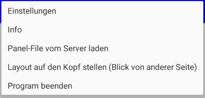

# Menü

Durch Berühren der 3 Punkte ganz rechts oben öffnet sich ein übliches Menü, in diesem Fall mit der Auswahl:

## Einstellungen 

mehr zu den [Einstellungen hier](04-Einstellungen.md)

## Info 

Info (About) Fenster mit Programm Version

## Hilfe / Handbuch

Anzeige der Dokumentation (Handbuch von LanbahnPanel)

## Panel-File vom Server laden 

Über das SX4 Programm kann ein Panel-File (der im aktuellen Verzeichnis des SX4-Programms auf dem PC liegt) auf das Tablet heruntergeladen, gespeichert und dann in den Einstellung zum Betrieb ausgewählt werden. 

## Layout auf den Kopf stellen 

Oben und unten in der Ansicht des Panels vertauschen

## Programm beenden 

Schliesst auch die Kommunikation zum Server (die bei einfachen Pausieren der App durch den „Zurück Pfeil“ oder den „Home Button“ sonst weiterläuft) - bitte also im Interesse der Batterielaufzeit immer „Programm beenden“ benutzen.

### ==> Weiter zu [Einstellungen](04-Einstellungen.md)
    
