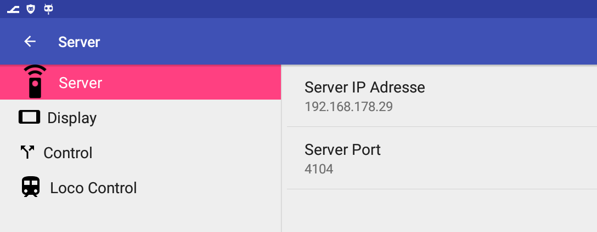
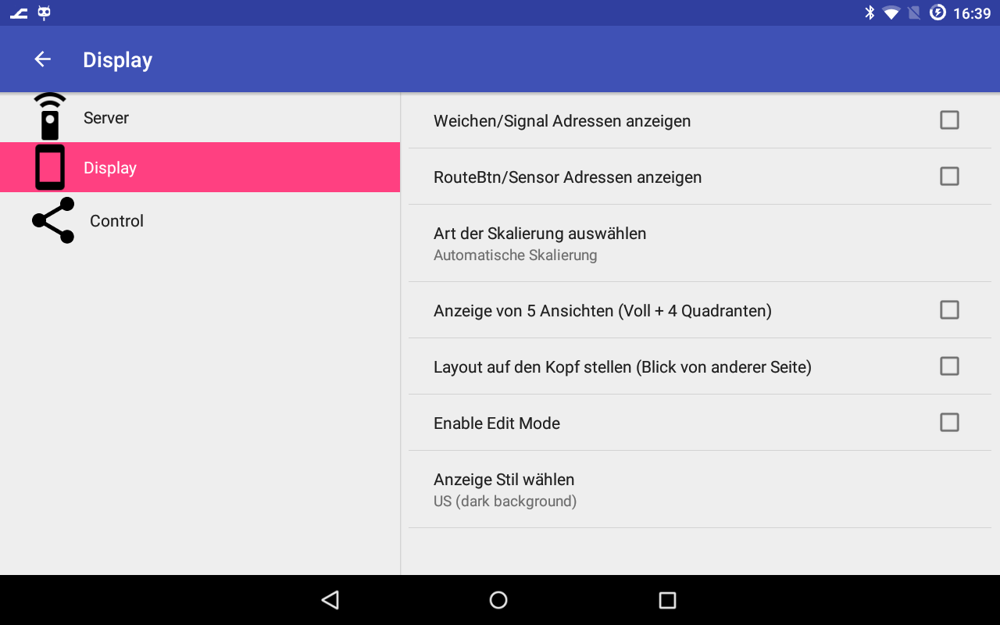
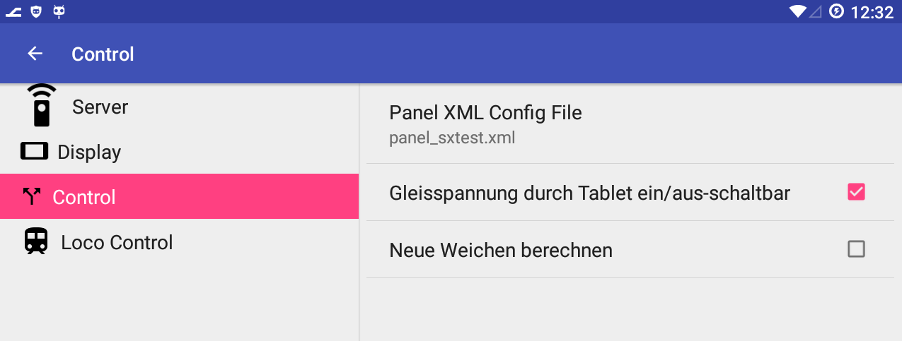
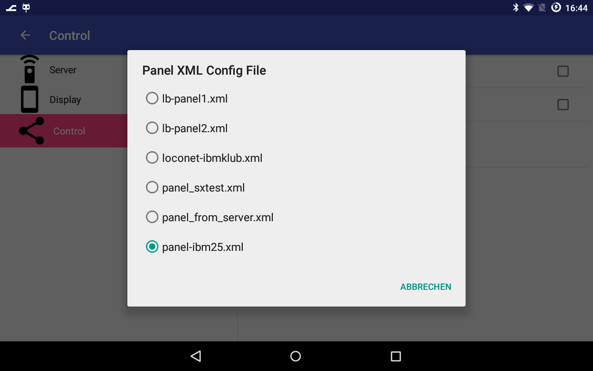
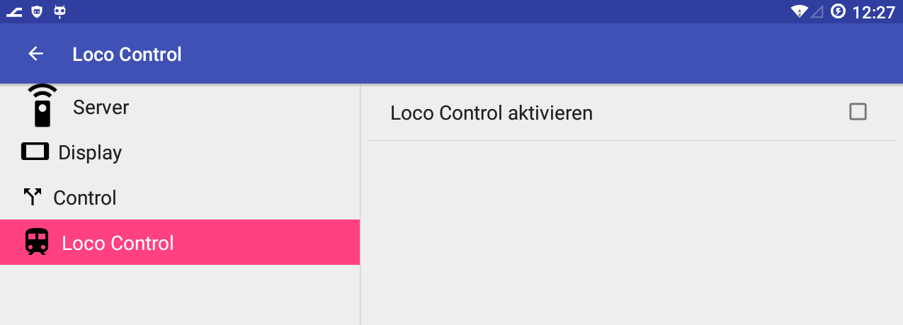

# Einstellungen

Es gibt vier Bereiche: 
* Server
* Display
* Control
* LocoControl

## Server

IP und Port des Rechners, auf dem das SX4 Programm läuft

## Disply (Art der Anzeige)

## Skalierung

zur Auswahl werden drei Möglichkeiten angeboten:
1. Automatische Skalierung: sinnvoll, wenn man ein neues Layout-File zum ersten Mal ausgewählt hat.
2. Manuell (Zoom/Pan): damit kann man dann Finetuning des Ausschnitts machen (mit 2 Fingern Zoom, mit einem Finger Pan (Verschieben)
3. danach kann man den Ausschnitt fixieren durch Auswahl von „Skala fest“

Ein Tip zur Skalierung: die automatische Skalierung erzeugt im Moment keinen Overlap zwischen den 4 Quadranten-Ansichten eines Panels. Dies kann man aber durch Punkt (2) korrigieren, indem man in allen 4 Quadranten manuell einen Ausschnitt wählt und dann (3) in den Settings auf "Skala fest" umschaltet. Diese Skalierung geht auch nach dem Beenden des Programms nicht verloren  (AUSSER: man schaltet zwischendurch mal auf Automatische Skalierung um, dann werden ALLE Quadranten neu berechnet! ) 

## Control

Mit „Panel XML Config File“ kann ein neuer Config-File ausgewählt werden. Er muss im Verzeichnis „sdcard/lanbahnpanel“ liegen – es werden alle Files mit der Endung „.xml“ zur Auswahl angezeigt.

## Loco Control

Falls aktiviert, wird zwischen Kopfzeile/Menü des Programms und dem Gleisbild ein Regler angezeigt, mit dem man eine Lok steuern kann.

### ==> Weiter zu [Bedienung](05-Bedienung.md)
    
