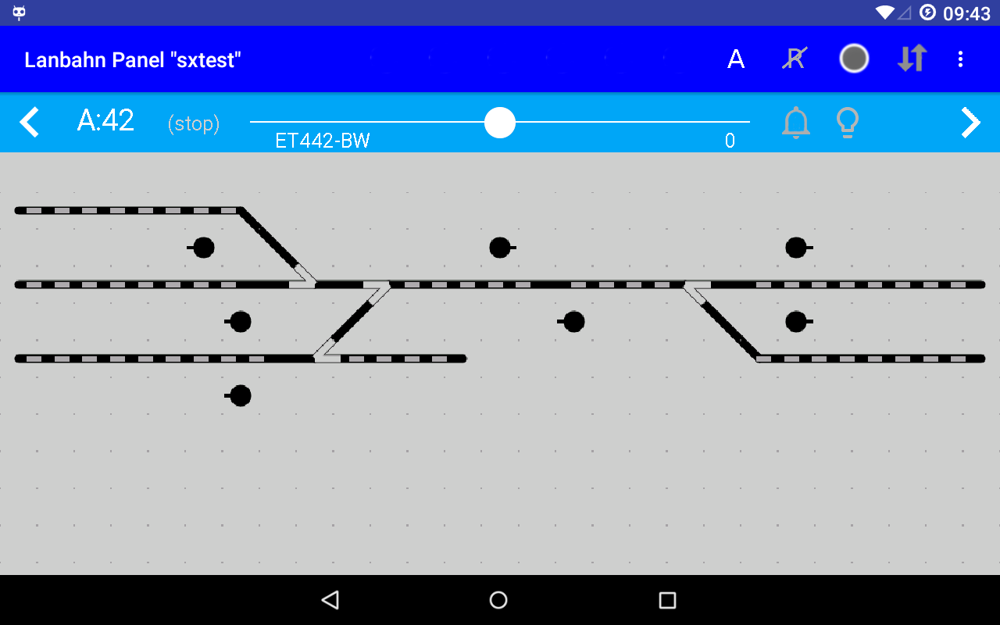
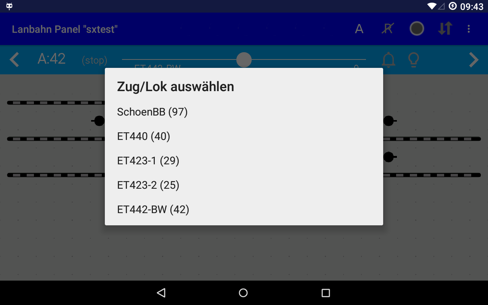
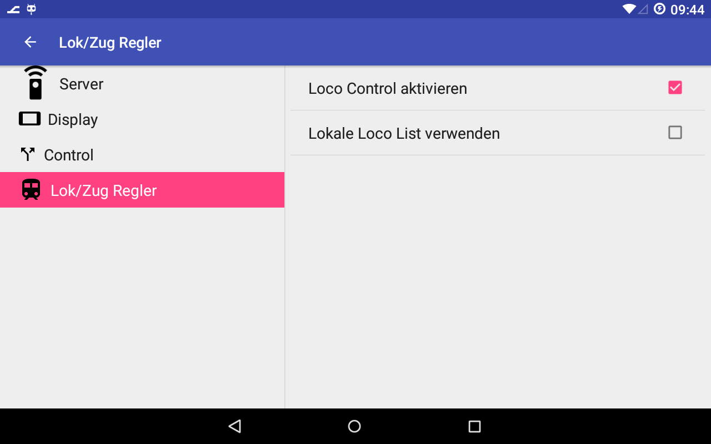

# Bedienung

## Weichen schalten

Durch Click auf eine Weiche wird der aktuelle Weichenzustand umgeschaltet.

## Signal schalten

Durch Click auf ein Signal wird der aktuelle Signalzustand umgeschaltet - hierbei sind nur "Rot" und "Grün" möglich. (weitere Signalbilder bei Aktivieren von [Fahrstraßen](06-Fahrstrassen.md) im SX4 Programm)

## Loco Control

Falls aktiviert, wird oben über dem Gleisbild ein Regler angezeigt, mit dem man eine Lok steuern kann. 

Es stehen hier alle Lok-Adressen zur Auswahl, die im Panel.xml File definiert sind - Auswahl aufrufen durch Click auf die Adresse:

Aktivieren über die [Einstellungen](04-Einstellungen.md) - Bereich "Loco Control":

Wählt man hier "Lokale Loco List" aus, so können Lokadressen im Programm hinzugefügt werden (man ist also nicht auf die Liste der Lok-Adressen im Panel-File angewiesen).

### ==> Weiter zu [Fahrstraßen](06-Fahrstrassen.md)
    
