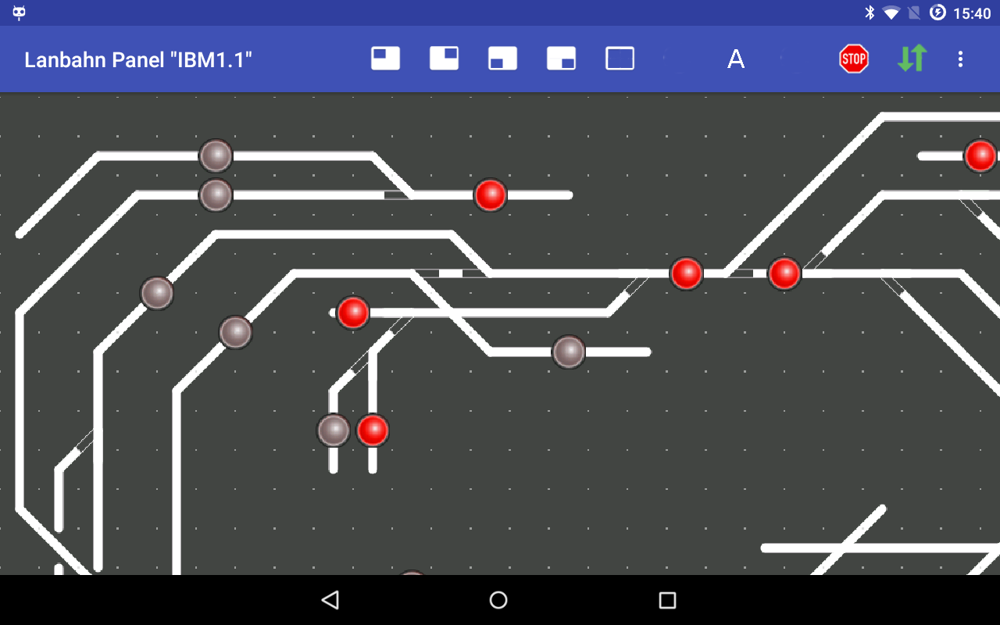

# LanbahnPanel (Android)

Das LanbahnPanel Programm ist geeignet, um mit einem Android Tablet  die Weichen, Signale und Fahrstrassen einer Modellbahn zu steuern. Dies funktioniert für Selectrix per [SX4 (PC)](https://opensx.net/sx4) - dies ist ein Programm, welches über USB/RS232 die Verbindung zur Modellbahn herstellt (und über eine TCP Netzwerkverbindung die Verbindung zum Tablet).

Auch Steuerung von Fahrstraßen und ein automatischer Ablauf eines Fahrplans sind möglich - dieser wird zentral durch das SX4-Programm gesteuert (siehe [SX4 Dokumentation](https://michael71.github.io/SX4)).
  
## Installation
Das Programm kann über den [Google Play Store](https://play.google.com/store/apps/details?id=de.blankedv.lanbahnpanel) installiert werden (mind. Android 4.0.3 und am besten auf einem Tablet). Alternativ kann es auch über Github als apk-File heruntergeladen werden.

### ==> Weiter zu [Start](01-Start.md)

